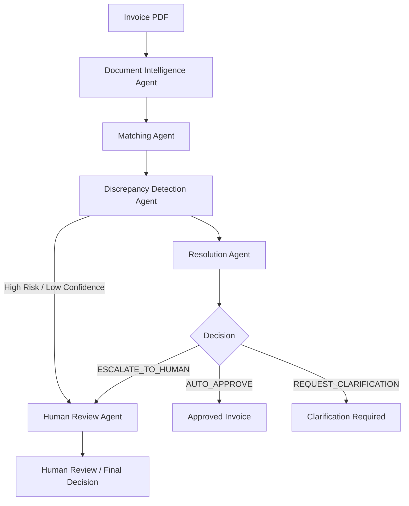

# Multi-Agent LLM Document Intelligence Pipeline

An end-to-end multi-agent document intelligence system for automated invoice reconciliation. The pipeline uses LangGraph to coordinate specialized agents that extract information from invoices, match invoices against purchase orders, detect discrepancies, recommend resolutions, and escalate high-risk cases for human review.

The system is designed to handle real-world document variations including scanned PDFs, different invoice layouts, missing purchase-order references, and pricing or quantity discrepancies.

## Architecture

## Workflow

Invoice PDF
    ↓
OCR / Document Extraction
    ↓
Structured Invoice Data
    ↓
Purchase Order Matching
    ↓
Discrepancy Detection
    ↓
Resolution Recommendation
    ↓
Decision
    ├── AUTO_APPROVE
    ├── REQUEST_CLARIFICATION
    └── ESCALATE_TO_HUMAN

